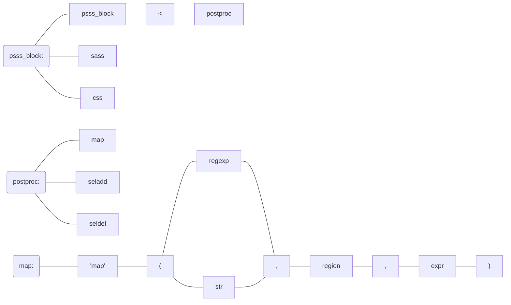

# psss
post scriptable style sheet: EXPERIMENTAL/MEMO, not for use

```mermaid
graph LR
    stext1("psss_block: ") ---
    psss_block --- postprocsep["<"] --- postproc
    sass
    css
    stext1 --- sass
    stext1 --- css

    stext2("postproc:") --- map
    seladd
    seldel
    stext2 --- seladd
    stext2 --- seldel

    stext3("map:") --- maptok['map'] --- parL["("] --- regexp --- comma1[","] ---  region --- comma2[","] --- expr --- parR[")"]
    parL --- str --- comma1

    linkStyle 0,3,4 stroke-width:1;
    classDef simpleText border:none,border-width:0,    background-color:white,margin-right:0px;
    classDef spacing margin-left:20px;
    class stext1 simpleText;
    class spacing1,spacing2 spacing;
```