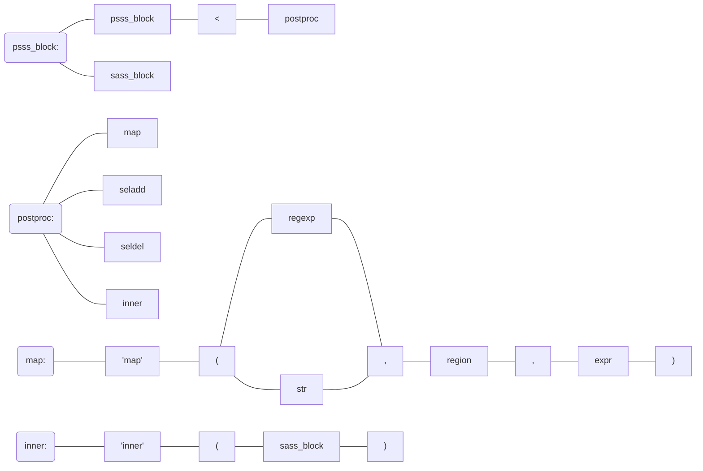

# psss
Post Scriptable Style Sheet: EXPERIMENTAL/MEMO -- just making clear of this idea for now.  
May SASS is enough, but even so, making such a weird tool is fun for me.  

* Stream-like creation of stylesheet.
* Want to reduce cursor movement.

